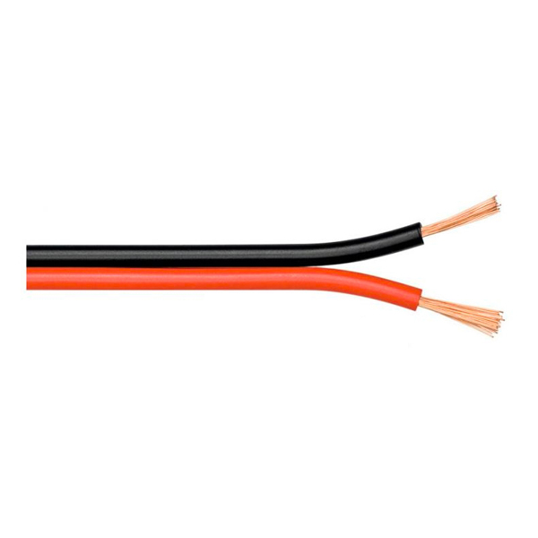

# 1.2. Cable de par sin trenzar

### Descripcion

El **cable de par sin trenzar**, tambien llamado cable **paralelo**, es un cable que como su nombre indica funciona sin necesidad de que sus hilos se trenzen.

Este tipo de cable esta formado por dos hilos de cobre en paralelo llamados "nucleos de cobre ". Estos núcleos estan cubiertos con una envoltura de plástico que los aisla.  Usan un tipo de conexión **semidúplex**, permitiendo el paso de la información en los dos sentidos pero nunca  a la vez.&#x20;

Este tipo de conexión presenta muy poca protección frente al ruido y a las interferencias. Es por eso que este tipo de medio no se utiliza para conectar distancias muy largas donde puede afectar a la estabilidad de la conexión. Por este motivo, se usa  en longitudes no superiores a un par de metros.

Este tipo de cable se utiliza dentro del ordenador para comunicar componentes internos. También se utiliza en redes telefónicas y en el tendido eléctrico.

### Conectores

Este tipo de cable utiliza un conector espcífico, el **RJ-11**. Este conector suele utilizarse en todo tipo de redes de telefonía. está formado por 6 posiciones con 4 contactos centrales para los 4 hilos del cable.&#x20;

Los conectores RJ-11 son casi siempre de este mismo tipo, con cuatro cables hacia una caja de conexiones central. Dos de sus seis posiciones de contacto son utilizadas como conectores fase y neutro, mientras que los otros dos conductores no son utilizados.


Documento elaborado por: Israel Arroyo Aranda

