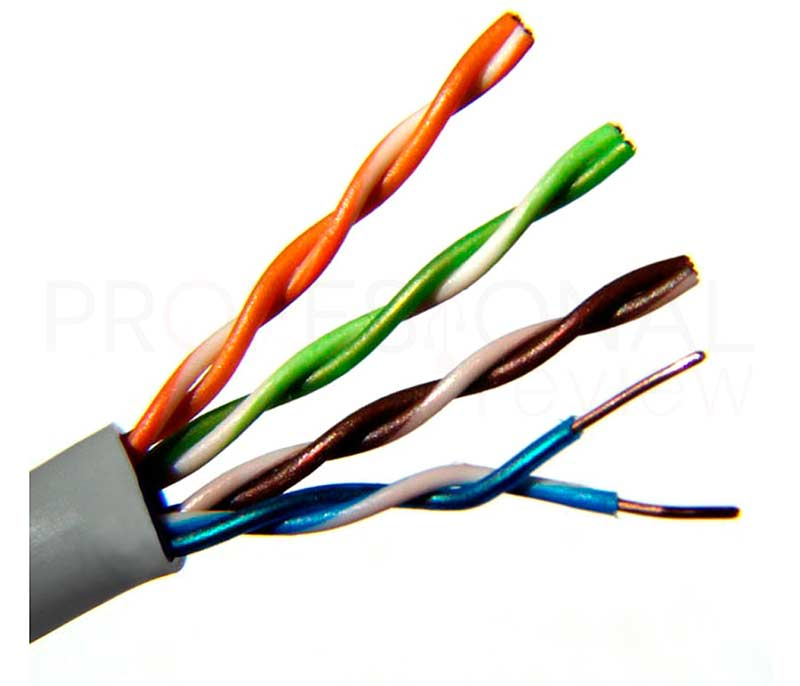
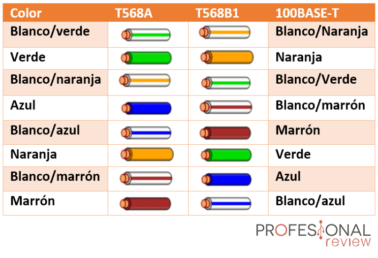
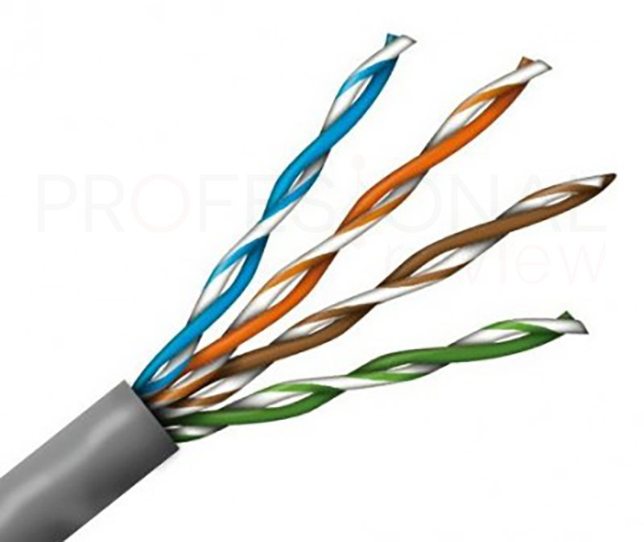
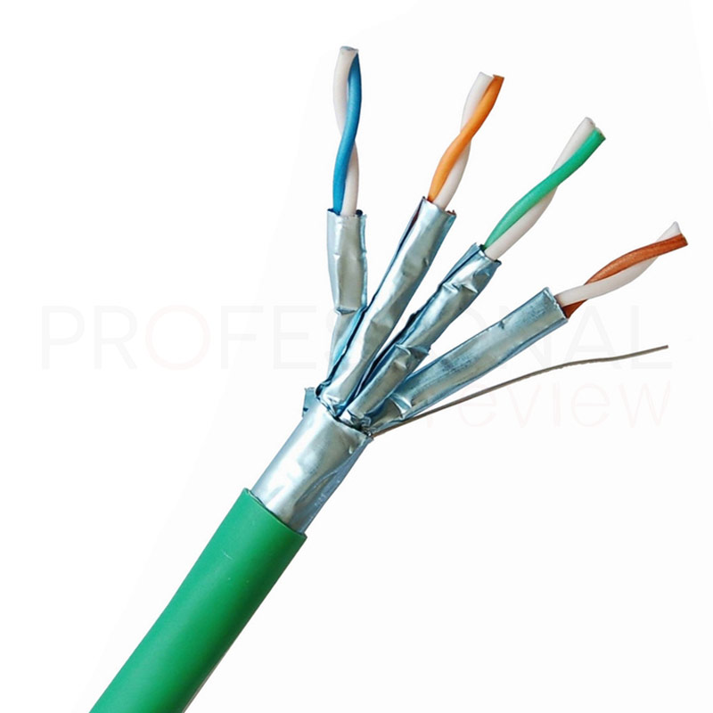

# 1.3. Cable de par trenzado

### Descripcion

El **cable de par trenzado** es un tipo de cable que tiene dos  conductores eléctricos aislados y entrelazados para anular las interferencias de fuentes externas de los cables adyacentes. Fue inventado por [Alexander Graham Bell](https://es.wikipedia.org/wiki/Alexander\_Graham\_Bell) en 1881.

es una de las conexiones más utilizadas desde su invención. Fue  una revolución en la industria, ya que su ingeniosa pero sencilla construcción permitía alcanzar distancias más lejanas al soportar mejor las interferencias y llevar mayor cantidad de datos.

Utilizamos este tipo de cable **para conectarnos a Internet**  desde nuestra casa, y también para muchas otras aplicaciones de comunicaciones. Sin embargo su total sustitución fuera de nuestra casa o de un edificio es inminente, ya que **la irrupción de la fibra óptica** hace unos años ha mejorado en todos los sentidos lo que ofrecen este tipo de cables en largas distancias.

Como su propio nombre indica, el cable par trenzado consiste en **pares de cables que se entrecruzan en forma de bucle en espiral.** Cada conductor individual está fabricado en cobre o aluminio, cubierto de un aislante de plástico individual. Su denominación de pares trenzados es por el hecho de que cada cable contiene varios de estos pares en un encapsulado general, normalmente **4**.  la conexión se efectúa a través de un puerto llamado **RJ45**

### Tipo de conexion

El cable de par trenzado tiene distintos usos, como los enlaces de comunicaciones telefónicas, pero su uso principal es el de **redes de datos bajo el estándar IEEE 802.3 conocido como Ethernet.**

Este fue diseñado por la **EIA** (Electronic Industries Alliance), en donde se creó el estándar **TIA/EIA-568-B** y **568-A** estos engloban las directrices sobre el diseño e instalación de sistemas de red cableados. En ellas se mencionan una serie de prácticas para asegurar que las redes se diseñen para soportar servicios en un futuro y la calidad de los cables.

* **TIA/EIA 568-A**: regula todo lo que tiene que ver con instalaciones en edificios, topologías, distancia máxima de cableado, su rendimiento y las tomas que se utilizarán.
* **TIA/EIA-568-B**: en ella se definen los tipos de cables, conectores utilizados, características y mantenimiento.

El cable par trenzado cruzado, sirve para **conectar dos equipos que sean iguales**, por ejemplo, dos ordenadores entre sí. La diferencia con el otro es que **los dos extremos son distintos**, teniendo algunos cables intercambiados entre sí para asegurar una **conexión full-dúplex** entre dos tarjetas de red.

En el siguiente  caso uno de los extremos está conectado según la norma 568-A y el otro según la 568-B.

En la actualidad este tipo de conexión cruzada no es tan importante, ya que las tarjetas de red Gigabit Ethernet actuales tienen **la capacidad de seleccionar de forma automática la forma en la que están trabajando. Esta se denomina MDI/MDI-X.**

****

### **Categorias**

Según la norma Ethernet, los cables de par trenzado se dividen en **varias categorías** en función del ancho de banda que sean capaces de ofrecer.&#x20;

Esta certificación de categoría sirve para **asegurar que ese cable va a darnos un determinado ancho de banda o superior**, pero nunca inferior.

hasta la actualidad, existen las siguientes categorías:

* **CATEGORIA 1.**  Este tipo de categoría esta en deshuso, permite transmitir a una velocidad de 1MHz.

* **CATEGORIA 2.** Este cable actualmente también está en deshuso, permite transmitir a una velocidad de 4MBs.

* **CATEGORIA 3.**  Usado en redes antiguas de redes ethernet. Ofrece un ancho de banda de hasta 10Mbps

* **CATEGORIA 4.** Este cable es un poco más rapido, permitiendo velocidades de 20Mbps.

* **CATEGORIA 5.** Algunos de estos cables vienen con apantallamiento, **** Soporta transmisiones **** a **** 100 Mbps y a una frecuencia de 100 MHz.
* &#x20;Surgio una subcategoria, la **5E,** esta puede brindar hasta 1000Mbps y ya es mas común encontrarnosla en el mercado.

* **CATEGORIA 6.**  Este cable es de uso generalizado en redes LAN internas, ya que ofrece **velocidades de 1000 Mbps** como el anterior, pero soportando **frecuencias de 250 MHz** al ser apantallado. Esto implica que su estructura interna soporta mejor las interferencias.
  * una ampliación fue la subcategoria **6E,**

****

* **CATEGORIA 7.**  este tipo de cable se utiliza en los **centros de datos.** Cuenta con blindado, lo que permite operar en **frecuencias de 600 MHz y a velocidades de 10 Gbps a una distancia de 100 m**.
  * Otra variante de la categoría anterior es la **7A** para cables que sean capaces de transmitir a **frecuencias de 1000 MHz y velocidades de entre 10 y 40 Gbps.**

****

* **CATEGORIA 8.** La última categoría listada se trata de **la más potente en la actualidad**, con cables par trenzado capaces de llegar a los **40 Gbps y operar en frecuencias de 2000 MHz**.

### Construccion de los cables

Junto al ipo de categoria, viene muy ligado a esta el tipo de construcción del cable, ya que deendiendo de esta, permitirá alcanzar una menor o mayor velocidad.

entre los tipos de cable destacan:

| TIPO | CATEGORIAS    | IMAGEN                                                    |
| ---- | ------------- | --------------------------------------------------------- |
| UTP  | 5E y 6        |         |
| STP  | 6 y 6e        |         |
| SFTP | 6 en adelante | .jpg>) |


Documento elaborado por: Israel Arroyo Aranda

