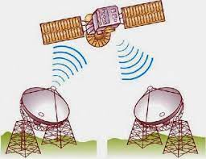
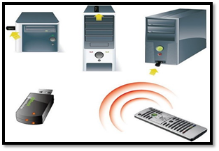

# 2.1. Introducción

Los medios de transmisión no guiados son los que no confinan las señales mediante ningún tipo de cable, sino que las señales se propagan libremente a través del medio. Entre los medios más importantes se encuentran el aire y el vacío.&#x20;

Tanto la transmisión como la recepción de información se lleva a cabo mediante antenas. A la hora de transmitir, la antena irradia energía electromagnética en el medio. Por el contrario en la recepción la antena capta las ondas electromagnéticas del medio que la rodea.&#x20;

La configuración para las transmisiones no guiadas puede ser direccional y omnidireccional.&#x20;

* En la direccional, la antena transmisora emite la energía electromagnética concentrándola en un haz, por lo que las antenas emisora y receptora deben estar alineadas.&#x20;
* En la omnidireccional, la radiación se hace de manera dispersa, emitiendo en todas direcciones pudiendo la señal ser recibida por varias antenas. Generalmente, cuanto mayor es la frecuencia de la señal transmitida es más factible confinar la energía en un haz direccional. La transmisión de datos a través de medios no guiados, añade problemas adicionales provocados por la reflexión que sufre la señal en los distintos obstáculos existentes en el medio. Resultando más importante el espectro de frecuencias de la señal transmitida que el propio medio de transmisión en sí mismo.&#x20;

Según el rango de frecuencias de trabajo, las transmisiones no guiadas se pueden clasificar en tres tipos: radio, microondas y luz (infrarrojos/láser).

|             Radiotransmision             |           Microondas          |          Infrarrojos          |
| :--------------------------------------: | :---------------------------: | :---------------------------: |
| .jpg>) |  |  |

