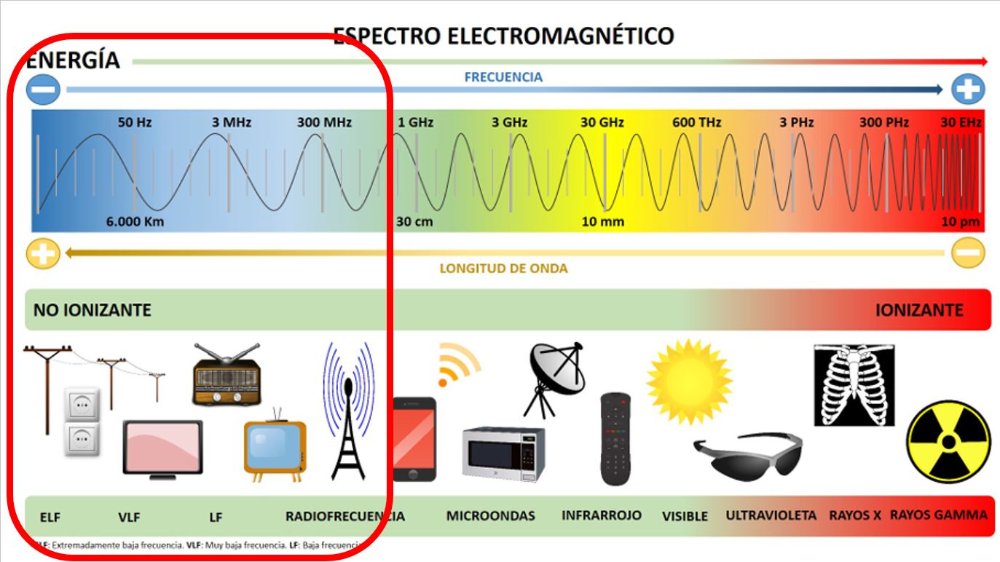

# 2.2. Radiotransmisión

### Antenas

Después de que un transmisor genere una señal de RF, debe haber algún método de radiar esta señal al espacio y debe haber también otro método para que un receptor intercepte o capte la señal. La antena cumple estos requerimientos.&#x20;

Una antena convierte las corrientes de alta frecuencias en ondas electromagnéticas para su transmisión y justamente hace lo contrario para la recepción. Las antenas transmisoras y receptoras tienen distintas funciones, pero se comportan exactamente igual. Es decir, su comportamiento es recíproco.

### Radio programación

La energía radiada de una antena transmisora viaja en el espacio en muchas direcciones. Según la distancia a la antena aumenta, el campo de energía se expande y la intensidad de campo disminuye. Sin embargo, el camino o caminos mediante los cuales la señal alcanza la localización del receptor también afecta la intensidad de campo. Hay tres amplias clasificaciones de camino de la señal. Estas son: la onda de tierra, la onda de espacio, y la onda celeste.&#x20;

### Ondas de tierra

La onda de tierra es una onda de radio que viaja a lo largo de la superficie de la tierra. En las bandas de baja frecuencia (LF) y frecuencia media (MF), este es el modo predominante de propagación. Estas longitudes de onda más largas tienden a seguir la curvatura de la tierra y realmente viajan más allá del horizonte. Sin embargo, según la frecuencia aumenta, la onda de tierra es más efectivamente absorbida por las irregularidades de la superficie terrestre. Esto es debido, a que según la frecuencia aumenta, las montañas, colinas, etc., se hacen significativas con relación a la longitud de onda transmitida.


Si quieres saber mas sobre la radio frecuencias, este video es un buen lugar para empezar





Documento elaborado por: Álvaro Abad

