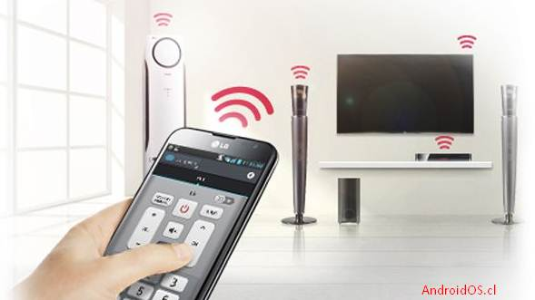

# 2.4. Señal infrarroja y láser

### 2.4.1.Señal infrarroja&#x20;

La radiación infrarroja o radiación térmica es un tipo de radiación electromagnética de mayor longitud de onda que la luz visible, pero menor que la de las microondas. Consecuentemente, tiene menor frecuencia que la luz visible y mayor que las microondas. Su longitud de onda, entre 700 nanómetros y un milímetro, es la siguiente en longitud al rojo, el color de longitud de onda más larga de la luz visible.

Por otro lado, dependiendo de su ubicación dentro del rango de longitud de onda, los rayos infrarrojos podrán ser de tres tipos:

* **Infrarrojo cercano**. Están entre 0,78 y 2,5 micrómetros (es el rango más cercano al espectro visible).
* **Infrarrojo medio**. Están entre 2,5 y 50 micrómetros.
* **Infrarrojo lejano**. Están entre 50 y 1000 micrómetros.

#### Comunicación por infrarrojos

Las redes por infrarrojos permiten la comunicación entre dos nodos, y para ello utilizan una serie (por lo menos un par) de ledes. Esa es su principal desventaja, a diferencia de otros medios de transmisión inalámbricos (bluetooth, etcétera).

**Modo punto a punto**

Los patrones de radiación del emisor y del receptor deben de estar lo más cerca posible y que su alineación sea correcta. Como resultado, el modo punto-a-punto requiere una línea-de-visión entre las dos estaciones a comunicarse. Este modo punto-a-punto conectado a cada estación.

**Modo casi difuso**

Son métodos de emisión radial, es decir que cuando una estación emite una señal óptica, esta puede ser recibida por todas las estaciones al mismo tiempo en la célula.

En el modo casi–difuso las estaciones se comunican entre ellas por medio de superficies reflectantes.

No es necesaria la línea de visión entre dos estaciones, pero sí deben de estarlo con la superficie de reflexión. Además, es recomendable que las estaciones estén cerca de la superficie de reflexión, esta puede ser pasiva o activa. En las células basadas en **reflexión pasiva**, el reflector debe de tener altas propiedades reflectivas y dispersivas, mientras que en las basadas en **reflexión activa** se requiere de un dispositivo de salida reflexivo, conocido como satélite, que amplifica la señal óptica. La reflexión pasiva requiere más energía, por parte de las estaciones, pero es más flexible

#### Usos&#x20;

* **Equipos de visión nocturna**. A través de detectores de luz infrarroja, se fabrican dispositivos ópticos que la traducen al espectro visible, y nos permiten “ver” en lo oscuro, guiándonos por&#x20;
* **Mandos a distancia**. Es común el uso de emisores de rayos infrarrojos en controles remotos y otros tele dispositivos, que de otro modo tendrían que acudir a las ondas de radio y generarían “ruido ambiental” para otras formas más importantes de transmisión de datos, como el Wi-Fi.
* &#x20;**Transmisión digital por infrarrojo**. Este tipo de tecnología de transmisión de datos (entre computadoras o entre computadoras y sus periféricos cercanos) emplea señales infrarrojas para transmitir datos a corta distancia.
* **Estudio espectroscópico en astronomía**. Midiendo la radiación infrarroja de la atmósfera de las estrellas frías, los astrónomos son capaces de estudiar los elementos químicos presentes en ellas. También se utilizan estos rayos para estudiar las nubes moleculares en el espacio.
* &#x20;**Vigilancia y seguridad**. La medición de los niveles de temperatura en un ambiente cerrado permite nuevas formas de vigilancia y seguridad, como la aplicada en los aeropuertos durante períodos de pandemia, para detectar niveles anormales de temperatura en una masa de gente en movimiento.

#### Puerto infrarrojo

El **puerto infrarrojo** (del inglés **IR Blaster**) es un transmisor de luz infrarroja que envía luz a receptores de infrarrojo al igual que un control remoto (el puerto infrarrojo es el componente primario de un control remoto). Este componente no sólo es usado en controles remotos, sino también en dispositivos que pueden ser usados como control remoto universal, por ejemplo: Algunos teléfonos inteligentes, tabletas o en su rara ocasión los smartwatches

### **2.4.2.Laser**

#### ¿Qué es?

LÁSER es un acrónimo y significa "Light Amplification by Stimulated Emission of Radiation" ("Amplificación de Luz por Emisión Estimulada de Radiación"). Dicho más fácil: Las partículas de luz (fotones) excitados con corriente emiten energía en forma de luz. Esta luz se concentra en forma de haz. Por lo tanto, se ha formado el rayo láser.&#x20;

#### Componentes

1. Una carga de átomos (un sólido, líquido o gas) con electrones a estimular alrededor del núcleo, como hemos visto. Esto se conoce como el **medio láser** o, a veces, el medio de amplificación o «ganancia» (porque “ganancia” es otra forma de referirse a la amplificación).
2. &#x20;Algo con lo que estimular los átomos, como un tubo de flash (como la lámpara de flash de xenón en una cámara) u otro láser. Esto se denomina **sistema de bombeo**.
3. Una **cavidad óptica**, como un tubo de flash de una lámpara de xenón

#### Funcionamiento

* Un suministro eléctrico de alto voltaje hace que el tubo de flash (como el de una lámpara de xenón) se encienda y apague intermitentemente.
* Cada vez que el tubo parpadea, «bombea» energía al cristal de rubí. Los flashes hacen que se inyecte energía en el cristal de rubí en forma de fotones.
* Los átomos en el cristal (los puntos verdes grandes) absorben esta energía en un proceso llamado absorción. Los átomos absorben energía cuando sus electrones saltan a un nivel de energía más alto, como hemos visto anteriormente. Después de unos pocos milisegundos, los electrones vuelven a su nivel de energía original (estado fundamental) emitiendo un fotón de luz (los puntos azules más pequeños). Esto se llama **emisión espontánea**.
* Los fotones emitidos por los átomos se acercan y alejan dentro del cristal de rubí, viajando a la velocidad de la luz.
* En algunos momentos, uno de estos fotones estimula un átomo ya excitado. Cuando esto sucede, el átomo excitado emite un fotón y recuperamos también nuestro fotón original. Esto se llama **emisión estimulada**. En ese momento, un fotón de luz ha producido dos fotones de luz, así que ésta se ha amplificado (aumentado en fuerza). En otras palabras, la «amplificación de luz» (un aumento en la cantidad de luz) ha sido causada por «emisión estimulada de radiación», de la que hemos hablado al principio. De ahí el nombre “láser”.
* Un espejo en un extremo del tubo láser mantiene los fotones rebotando hacia adelante y hacia atrás dentro del cristal.
* Un espejo parcial en el otro extremo del tubo hace rebotar algunos fotones en el cristal, pero deja escapar a algunos.
* Los fotones que escapan forman un haz muy concentrado luz láser muy potente, que es lo que se usa, por ejemplo, para cortar un tubo metálico.

#### Usos

Los láseres están en todas partes, desde lectores de códigos de barras que usan un láser para convertir un código de barras impreso en un número que un ordenador pueda procesar hasta impresoras o reproductores de DVD o CD en los que un rayo láser semiconductor rebota en el disco giratorio para convertir su patrón impreso de datos en números y un chip en un ordenador convierte estos números en imágenes y sonido. Desde el envío de grandes volúmenes de datos por internet gracias a los láseres de fibra óptica hasta máquinas de cirugía médica y cosmética (por ejemplo, extirpación de tumores o eliminación de varices) y maquinaria de corte de metales de las piezas que lleva nuestro coche.

También se han desarrollado importantes aplicaciones en defensa, y de hecho, utilizando láseres de estado sólido bombeados por LED, se puede llegar a destruir infraestructuras de un enemigo en una guerra de forma más económica y precisa que los misiles convencionales, y se espera un despliegue mayor de estos usos durante esta década.
